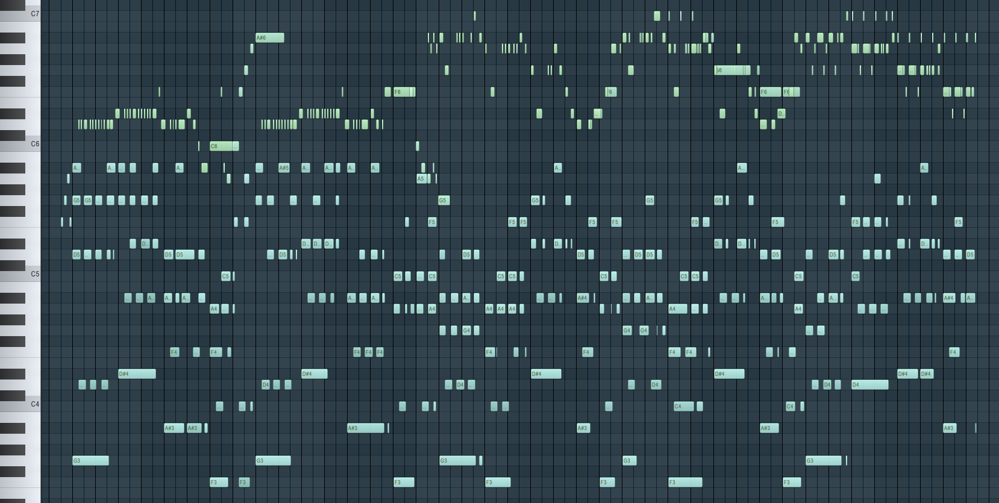

# MIDI Event Transformer

A hierarchical transformer architecture for generating MIDI music with a dual-level approach.


[Sample MP3](./sample/example_sample.mp3)

Unfortunately there currently is no prototype uploaded in this repository yet, as such model would exceed almost 1GB in size. 
I plan on uploading a version to the Hugging Face Model Hub at a later point of time. 

## Overview

This project implements a dual transformer architecture for hierarchical music generation. The model consists of two specialized transformers:

1. **Event Transformer**: Processes high-level musical events and captures the overall structure
2. **Token Transformer**: Handles token-level details within each event, providing fine-grained control

The architecture enables the generation of coherent and structured musical compositions by modeling both the macro-level musical progression and the micro-level details simultaneously.

## Architecture

The MIDI Event Transformer encodes MIDI files into token sequences where:
- Each MIDI event is converted into a token sequence
- The first token represents the event type (note, program change, etc.)
- Subsequent tokens represent various parameters (timing, pitch, velocity, etc.)

The dual transformer architecture then:
1. Processes events through an embedding layer
2. Captures temporal dependencies across events with the event-level transformer
3. Generates detailed token sequences with the token-level transformer
4. Outputs are combined to create the final MIDI representation

## Repository Contents

- `dual_transformer.py`: Main implementation of the dual transformer architecture (currently without proper caching for inference)
- `transformer_model.py`: Base transformer model implementation with rotary positional embedding
- `DualLlama.py`: Alternative implementation with proper caching (temporary solution) by [SkyTNT/midi-model](https://github.com/SkyTNT/midi-model)
- `midi_tokenizer.py`: MIDI tokenization utilities for converting between MIDI files and token sequences
- `dataset.py`: Dataset handling functionality for training the model
- `MIDI_Event_transformer_explanation.pdf`: Detailed explanation of the architecture and encoding process

## Installation

```bash
# Clone the repository
git clone https://github.com/yourusername/midi-event-transformer.git
cd midi-event-transformer

# Install dependencies
pip install torch numpy tqdm einops
pip install transformers peft
```

## Usage
### Training

```python
from dual_transformer import DualTransformer
from midi_tokenizer import MIDITokenizerV2
from dataset import MidiDataset, DataLoader

# Initialize tokenizer
tokenizer = MIDITokenizerV2()

# Create dataset
dataset = MidiDataset(tokenizer, midi_list=your_midi_files, max_events=128)
dataloader = DataLoader(dataset, batch_size=4, collate_fn=dataset.collate_fn)

# Initialize model
model = DualTransformer(
    vocab_size=tokenizer.vocab_size,
    event_context_size=128,
    token_context_size=8,
    n_embd=512,
    event_head=8,
    token_head=2,
    event_depth=6,
    token_depth=2,
    dropout=0.1
)

# Train the model
# ... (training code)
```
### Inference
Since the dual_transformer.py implementation currently lacks proper caching for efficient inference, use the DualLlama.py implementation for generation:
```python
from DualLlama import MIDIModel, MIDIModelConfig
import torch

# Load model
config = MIDIModelConfig.from_name("tv2o-medium")
model = MIDIModel(config)
model.load_state_dict(torch.load("path/to/checkpoint.pt"))

# Generate music
output = model.generate(
    prompt=None,  # Optional prompt
    batch_size=1,
    max_len=512,
    temp=1.0,
    top_p=0.98,
    top_k=20
)

# Convert to MIDI and save
midi_score = model.tokenizer.detokenize(output[0])
midi_data = MIDI.score2midi(midi_score)
with open("generated_music.mid", 'wb') as f:
    f.write(midi_data)
```
## Limitations
* The `dual_transformer.py` implementation currently lacks proper caching for efficient inference.
* Use the `DualLlama.py` implementation as an alternative until proper caching is implemented.

## Credits
* Tokenizer and Llama model implementation: [SkyTNT/midi-model](https://github.com/SkyTNT/midi-model)
